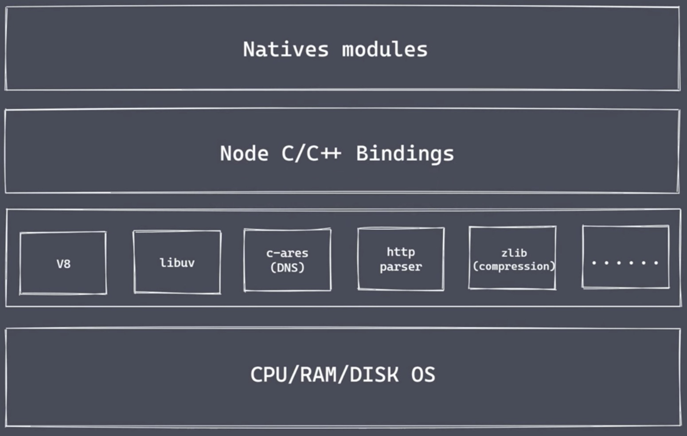
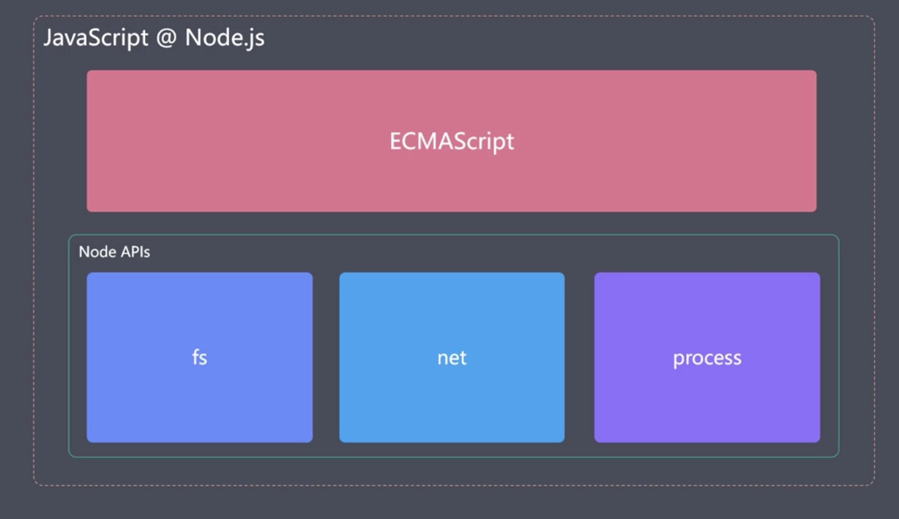
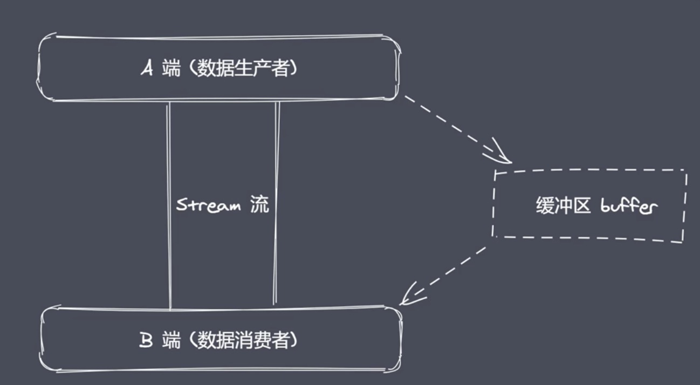
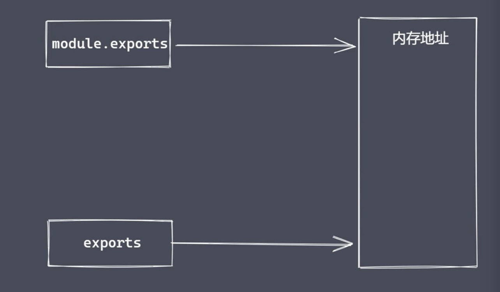
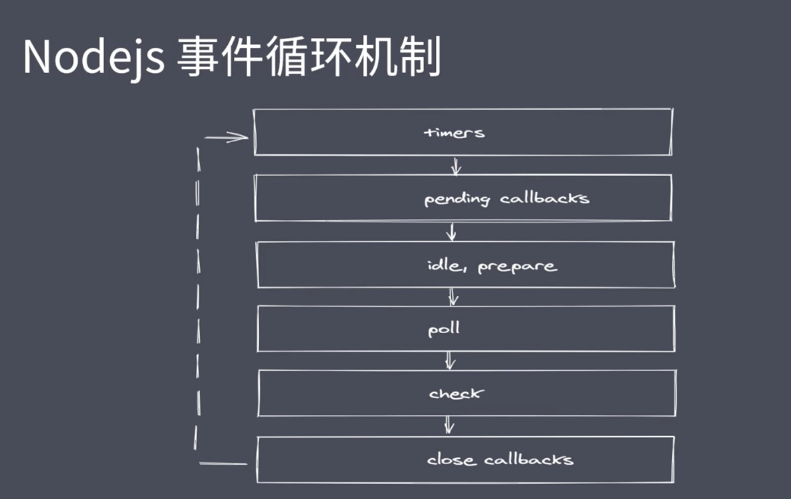
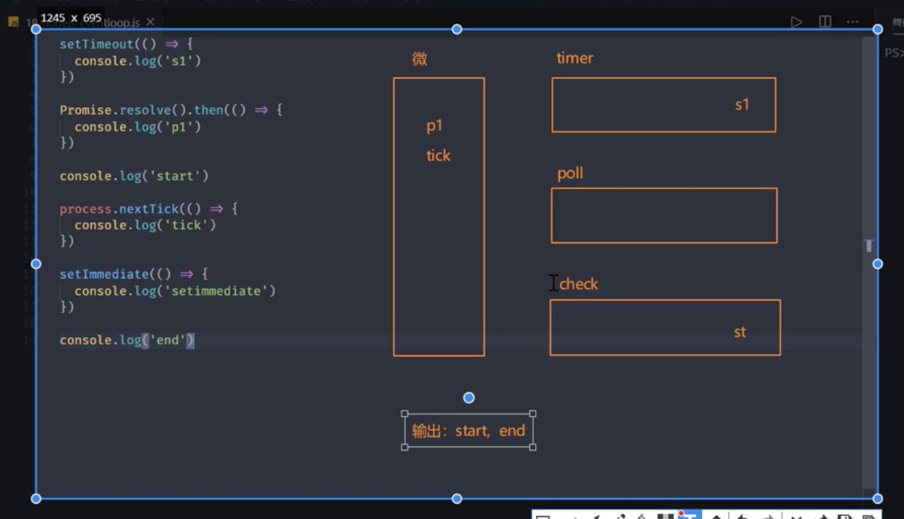

## node架构(核心)


1. Natives modules
- 当前层内容有JS实现
- 提供应用程序可直接调用库（内置核心模块），例如fs、path、http等
- JS语言无法直接操作底层硬件设置

2. Node C/C++ Bindings
- Builtin modules‘胶水层’ 作为桥梁，通过这个桥梁模块，node.js核心模块可以获取到具体的服务支持,从而去完成更底层的操作（例如：文件的读写行为）
- socket、http、etc等基础功能

3. 底层
- V8: 执行JS代码（自己编写的JS代码、内置的JS代码、第三方的JS代码），提供桥梁接口（js与C/C++之间的转化功能，JS调用的一些可以调用底层的功能是C/C++实现的，但是他不能直接调用，V8提供了中间的转换接口）
- Libuv: 事件循环、事件队列、异步IO
- 第三方功能模块：zlib、http、c-ares等

## Node.js的组成部分


Reactor模式（事件驱动机制），单线程完成多线程工作（避免多个线程之间，在上下文切换时需要考虑的状态保存、时间消耗以及状态锁等问题）
Reactor模式下实现异步IO、事件驱动

特性：异步IO、事件驱动、单线程
实现高并发请求的处理
缺点：不适合处理CPU密集型，大量且复杂的业务逻辑处理
Node.js更适用于IO密集型高并发请求

## 异步IO
IO分为 阻塞IO和非阻塞IO两种

非阻塞IO也有缺点：并不是一次性就拿到了需要的完整数据，需要重复调用IO操作，判断IO是否结束（称之为轮询）

常见的轮询技术：read、 select、 poll、 kqueue、 event ports
期望实现无须主动判断的非阻塞IO
libuv库实现了上述功能


总结
- IO是应用程序的瓶颈所在
- 异步 IO 提高性能无需原地等待结果返回
- IO 操作属于操作系统级别的，平台都有对应实现
- Node.js单线程配合事件驱动架构及libuv实现了异步非阻塞IO

## Nodejs 事件驱动架构


使用JS实现高效可伸缩的高性能Web服务


## Nodejs 应用场景

IO密集型的高并发请求：
- Nodejs中间层
- 操作数据库提供API服务
- 实时聊天应用程序
- 前端工程化

## NodeJs 常见全局变量

- __filename: 返回正在执行脚本文件的绝对路径
- __dirname: 返回正在执行脚本所在目录
- timer类函数：执行顺序与事件循环间的关系（setTimeout, setInterval, clearTimeout, clearInterval）
- process: 提供与当前进程互动的接口
- require: 实现模块的加载
- module、exports: 处理模块的导出

> 默认情况下this是空对象，和 global 并不是一样的

### process全局变量
- 获取资源、进程信息
- 运行环境信息
- 执行进程操作
```js
// 1、资源: cpu 内存
console.log(process.memoryUsage())
// 返回如下
// {
//   rss: 204333056,
//   heapTotal: 126713856,
//   heapUsed: 99454480,
//   external: 3604287,
//   arrayBuffers: 1813894
// }
console.log(process.cpuUsage()) // { user: 62000, system: 15000 } 返回运行代码时用户占用的时间片段，以及系统本身占用的时间片段

// 2、运行环境：运行目录、node环境、cpu架构、用户环境、系统平台
console.log(process.cwd()) // 当前的工作目录
console.log(process.version) // 当前node版本
console.log(process.versions) // 当前node内各个模块的版本
console.log(process.arch)// 本机操作系统型号：x64等
console.log(process.env)//当前环境
console.log(process.env.NODE_ENV) // 表示生产/开发环境, 默认为undefined
console.log(process.env.PATH)// 当前本机配置的系统环境变量
console.log(process.env.USERPROFILE/HOME) // 管理员目录（Mac使用HOME，windows使用USERPROFILE）
console.log(process.platform) // 返回运行平台是mac还是window

// 3、运行状态：启动参数、PID（进程ID）、运行时间
console.log(process.argv) // 启动命令时，可以代入参数，这个api可以拿到参数
console.log(process.argv0) // 获取第一个参数值
console.log(process.pid) // 进程ID
console.log(process.uptime()) // 运行时间，当前文件从运行开始到结束的整体的时间

//4、 事件
//当前脚本文件执行完成后触发
process.on('exit', (code) => {
  //code 状态码
  console.log('exit ' + code)
  //回调函数内部只能写同步代码，异步代码不支持
})
process.on('beforeExit',(code) => {
  //回调函数内部可以写异步代码
  console.log('before exit ' + code)
  setTimeout(() => {
    console.log("setTimeout trigger")
    //需要手动结束进程
    process.exit(0)
  }, 1000)
})

//5、标准输出 输入 错误
console.log = function(data) {
  process.stdout.write('---' + data + '\n')
}

console.log(12222)

const fs = require('fs')
fs.createReadStream('list.json')
// 管道，通过管道将上述读取到的内容流向下一个地方
// 此例子是通过管道流向了标准输出process.stdout
.pipe(process.stdout)

//命令行输入的内容，会通过管道流向标准输出，然后打印在控制台中
process.stdin.pipe(process.stdout)

process.stdin.setEncoding('utf-8')
process.stdin.on('readable', () => {
  let chunk = process.stdin.read()
  if(chunk !== null) {
    process.stdout.write('data ' + chunk)
  }
})
```

### path相关API
basename()获取路径中基础名称  
dirname()获取路径中目录名称  
extname()获取路径中扩展名称  
isAbsolute()获取路径是否为绝对路径  
join()拼接多个路径片段  
resolve()返回绝对路径  
parse()解析路径(接收一个路径，返回一个对象)  
format()序列化路径，与parse功能相反  
normalize()规范化路径
```js
const path = require('path')
const obj = path.parse('/a/b/c/index.html')
console.log(obj)
// 返回结果如下
{
  root: '/', // 根路径
  dir: '/a/b/c', // 路径中最后一部分的上层目录的完整路径
  base: 'index.html', // 基础名称，路径中最后一部分的内容
  ext: '.html', // 文件扩展名，后缀
  name: 'index' // 文件名称或者最后一个目录名称
}

// resolve 绝对路径
/**
 * resolve([from], to)
 * 默认返回当前目录的绝对路径
 * 第一个参数不要前面加路径分隔符，否则会被忽略
 */
console.log(path.resolve()) // 返回当前目录的绝对路径
console.log(path.resolve('a', 'b')) // 返回当前目录的绝对路径并拼接了 a/b 在结尾处
console.log(path.resolve('a', '/b')) // 返回磁盘根目录并拼接上 /b, 在Mac中没有磁盘的概念只返回了“/b”，忽略了a，把/b做为绝对路径直接返回了
console.log(path.resolve('/a', '/b')) // 依然只返回了'/b', '/a'第一个参数被忽略了
console.log(path.resolve('/a', 'b')) // 返回了'/a/b'
```

### buffer（缓冲区）
起源：Javascript语言起初服务于浏览器平台，Nodejs平台下 Javascript 可实现 IO，IO 行为操作的就是二进制数据，Stream 流操作并非 Nodejs 独创（Stream流是可以分段存储的，避免数据内容太大，内存短时间内不足的情况），流操作配合管道实现数据分段传输  
数据的端到端传输会有生产者和消费者，生产和消费的过程往往存在等待，产生等待时数据存放在哪？存放在Buffer中
Nodejs 中 Buffer 是一片内存空间  

Buffer总结：
- 无须requier的一个全局变量
- 实现Nodejs平台下的二进制数据操作
- 不占据V8堆内存大小的内存空间（直接由C++程序来进行分配）
- 内存的使用由 Node 来控制，由 V8 的 GC 回收
- 一般配合 Stream 流使用，充当数据缓冲区  

Buffer 是 Nodejs 的内置类  
创建Buffer实例方法：
- alloc: 创建字节大小的buffer
- allocUnsafe: 创建指定大小的buffer（不安全）
- from: 接收数据，创建buffer
```js
const b1 = Buffer.alloc(10) // 申请10个字节大小的buffer空间
console.log(b1) // <Buffer 00 00 00 00 00 00 00 00 00 00> 每一个00都是一个16进制数据，一个0占据8位
const b2 = Buffer.allocUnsafe(10)
console.log("🚀 ", b2) // <Buffer 98 10 01 06 01 00 00 00 00 00> 可能会有一些空间碎片还没有清理完全，就被拿来使用了，所以是不安全的
const b3 = Buffer.from('1', 'utf8') // 第二个参数默认utf8
console.log("🚀 ", b3) // <Buffer 31>
// ASCII码：‘1’ 对应的 16进制为 31， 10进制为 49， 2进制为 110001
const b4 = Buffer.from('中')
console.log("🚀 ", b4) // <Buffer e4 b8 ad> 一个中文字符占 3 个字节

const b5 = Buffer.from([1,2,'中']) // 可以接收数组，但数组中只接受数值，中文字符无法转换
console.log(b5) // <Buffer 01 02 00>

const b6 = Buffer.from(b1) // 拷贝一个新的buffer，与b1不会共享内存
b6[0] = 1
console.log(b1)
console.log(b6)
// 返回
// <Buffer 00 00 00 00 00 00 00 00 00 00>
// <Buffer 01 00 00 00 00 00 00 00 00 00>
```
Buffer实例方法
- fill: 使用数据填充 buffer
- write: 向 buffer 中写入数据
- toString: 从 buffer 中提取数据
- slice: 截取 buffer
- indexOf: 在 buffer 中查找数据
- copy: 拷贝 buffer 中的数据
```js
let b1 = Buffer.alloc(6)
let b2 = Buffer.from('拉勾')
b2.copy(b1, 0, 3, 6) // 表示将 b2 的内容拷贝到容器 b1 中
// 第2个参数表示，拷贝的内容，从容器的哪个位置开始填充
// 第3个参数表示，从b2的哪个字节索引所在的位置开始拷贝
// 第4个参数表示，拷贝到哪个字节结束
```
Buffer静态方法
- concat: 将多个 buffer 拼接成一个新的 buffer
- isBuffer: 判断当前数据是否是 buffer 类型

自定义 Buffer 之 split
```js
ArrayBuffer.prototype.split = function(sep) {
  const len = Buffer.from(sep).length
  let start = 0
  let offset = 0
  let ret = []
  while(offset = this.indexOf(sep, start) !== 0) {
    ret.push(this.slice(start, offset))
    start = offset + len
  }
  ret.push(this.slice(start))
  return ret
}

let buf = 'karla吃馒头，吃面条，我吃所有吃'
let bufArr = buf.split('吃')
console.log(bufArr)
// 返回  ['karla', '馒头，', '面条，我', '所有', '']
```

## FS模块
Buffer、Stream与FS的关系？相互结合使用  
FS是内置核心模块，提供文件系统操作的API

### FS模块结构
- FS 基本操作类
- FS 常用API

常见flag操作符  
r: 表示可读  
w: 表示可写  
s: 表示同步  
+: 表示执行相反操作  
x: 表示排它操作
a: 表示追加操作 
fd是操作系统分配给发被打开文件的标识  

### 文件读写与拷贝操作
1. readFile: 从指定文件中读取数据
2. writeFile: 向指定文件中写入数据
3. appendFile: 追加的方式向指定文件中写入数据
4. copyFile: 将某个文件中的数据拷贝至另一文件
5. watchFile: 对指定文件进行监控
```js
const fs = require('fs')
const path = require('path')

// readFile path.resolve获取到的绝对路径，也可以写相对路径
fs.readFile(path.resolve('data1.txt'), 'utf-8', (err, data) => {
  console.log(err)
  if(!err) {
  console.log(data)
 }
})

// writeFile 
// 如果文件存在，覆盖文件原本的内容
// 如果是不存在的文件，则直接创建一个文件并写入内容
fs.writeFile('data1.txt', 'hello Node.js', (err) => {
  if(!err) {
    fs.readFile('data.txt', 'utf-8', (err, data) => {
      console.log(data)
    })
  }
})

fs.writeFile('data.txt', '11111', {
  mode: 438, // 操作权限权限位 438 是十六进制数字，表示可读可写
  flag: 'r+', // 从第一个位置开始重写内容，原本内容如果长度多于本次重写内容长度，则多出的部分会保留着
  encoding: 'utf-8'
}, (err) => {
  if(!err) {
    fs.readFile('data.txt', 'utf-8', (err, data) => {
      console.log(data)
    })
  }
})

// appendFile 追加文件内容
fs.appendFile('data.txt', ' hello karla', (err) => {
  if(!err) {
    console.log('写入成功')
  }
})

// copyFile
fs.copyFile('data.txt', 'test.txt', (err) => {
  if(!err) {
    console.log("拷贝成功")
  }
})

//watchFile
fs.watchFile('data.txt', {
 interval: 20 // 单位ms
}, (curr, prev) => {
  console.log("🚀 ~ file: file-api.js ~ line 53 ~ curr, prev", curr, prev)
  if(curr.mtime !== prev.mtime) {
    console.log("文件被修改了")
    fs.unwatchFile('data.txt') // 取消监控
  }
})
```
### 文件操作实现 md 转 html
```js
const fs = require('fs')
const path = require('path')
const marked = require('marked')
const browserSync = require('browser-sync')

/**
 * 01 读取 md 和 css 内容
 * 02 将上述读取出来的内容替换占位符，生成一个最终需要展示的 Html 字符
 * 03 将上述的 Html 字符写入到指定的 html 文件中
 * 04 监听 md 文档内容的变化，然后更新 html 内容
 * 05 使用 browser-sync 来实时显示 Html 内容
 */
let mdPath = path.join(__dirname, process.argv[2]) // 命令行第三个参数
let cssPath = path.resolve(__dirname, 'github.css')
let htmlPath = mdPath.replace(path.extname(mdPath), '.html')

fs.watchFile(mdPath, (curr, prev) => {
  if(curr.mtime !== prev.mtime) {
    fs.readFile(mdPath, 'utf-8', (err, data) => {
      // 将md转化为html
      let htmlStr = marked.parse(data)
      fs.readFile(cssPath, 'utf-8', (err, data) => {
        let retHtml = temp.replace('{{content}}', htmlStr).replace('{{style}}', data)
        // 将伤处的内容写入到指定的html文件中，用于在浏览器进行展示
        fs.writeFile(htmlPath, retHtml, (err) => {
          console.log('html 生成成功了')
        })
      })
    })
  }
})

browserSync.init({
  browser: '', // 本机默认浏览器
  server: __dirname,
  watch: true, // 监听热更新
  index: path.basename(htmlPath) // index.html
})
const temp = `
    <!DOCTYPE html>
    <html lang="en">
    <head>
        <meta charset="UTF-8">
        <title></title>
        <style>
            .markdown-body {
                box-sizing: border-box;
                min-width: 200px;
                max-width: 1000px;
                margin: 0 auto;
                padding: 45px;
            }
            @media (max-width: 750px) {
                .markdown-body {
                    padding: 15px;
                }
            }
            {{style}}
        </style>
    </head>
    <body>
        <div class="markdown-body">
            {{content}}
        </div>
    </body>
    </html>
`
```


### 文件打开与关闭
```js
// open
fs.open(path.resolve(__dirname, 'data.txt'), 'r', (err, fd) => { // fd文件操作符
  console.log(fd)
  // close
  fs.close(fd, (err) => {
    console.log('关闭成功')
  })
})
```
### 大文件读写操作
### 自定义大文件拷贝操作
### 常见目录操作API
* access: 判断文件或目录是否具有操作权限
* stat: 获取目录及文件信息
* mkdir: 创建目录
* rmdir: 删除目录
* readdir: 读取目录中内容
* unlink: 删除指定文件

## 模块化

传统开发常见问题
* 命名冲突和污染
* 代码冗余，无效请求多
* 文件间的依赖关系复杂
项目难以维护不方便复用  
模块就是小而精且利于维护的代码片段（具有低耦合，高复用特点的松散片段，模块化开发更像是将这些模块组合使用，从而完成项目的整体业务逻辑）  

最初没有模块化规范的时候  
利用函数、对象、自执行函数实现分块  

常见模块化规范
* Commonjs 规范
* AMD 规范 （异步加载，define,require实现模块加载，例如：requirejs）
* CMD 规范（cjs: 结合了Commonjs与AMD规范）
* ES modules 规范

模块化规范总结
* 模块化开发是前端走向工程化中的重要一环
* 早期 Javascript 语言层面没有模块化规范
* Commonjs、AMD、CMD、都是模块化规范
* ES6 中将模块化规范纳入标准规范
* 当下常用的规范是 Commonjs 与 ESM

### Commonjs 规范

1. Commonjs 规范起初是为了弥补 JS 语言模块化缺陷
2. Commonjs是语言层面的规范，而模块化规范只是他的一部分（它还包括IO，Stream流，buffer等使用规范），当前主要用于 Nodejs
3. Commonjs定义模块化操作分为三个部分
* 模块引用（require操作）
* 模块定义（exports导出操作）
* 模块标识（在Node中使用时，它就是我们使用require时传入的参数，也可称之为模块ID，一般是字符串，或者是相对路径，绝对路径）
4. Commonjs 规范定义模块的加载都是同步完成

module属性
* 任意js文件就是一个模块，可以直接使用module属性
* id： 返回模块标识符，一般是一个绝对路径
* filename: 返回文件模块的绝对路径
* loaded: 返回布尔值，表示模块是否加载完成
* parent: 返回对象，存放调用当前模块的模块
* children: 返回数组， 存放当前模块调用的其他模块
* exports: 返回当前模块需要暴露的内容
* paths: 返回数组，存放不同目录下的 node_modules 位置

module.exports与exports区别

module.exports与exports指向同一个内存地址  
不能给exports重新赋值，因为这样就切断了它们之间的联系


require属性
* 基本功能是读入并且执行一个模块文件
* resolve: 返回模块文件绝对路径
* extensions: 依据不同后缀名执行解析操作
* main: 返回主模块对象
```js
  // 如下
  extensions: [Object: null prototype] {
    '.js': [Function (anonymous)],
    '.json': [Function (anonymous)],
    '.node': [Function (anonymous)]
  }
```

### Nodejs与Commonjs
* 在Nodejs中，任意一个文件就是一模块，具有独立作用域
* 使用 require 导入其他模块
* 将模块ID 传入 require 实现目标模块定位

模块分类  
* 内置模块
* 文件模块  
模块加载速度  
* 核心模块： Node 源码编译时写入到二进制文件中（当某个node进程被启用时，某些核心模块就已经存在于内存之中了，因此它不需要去经历整个完成的加载流程，加载速度就会快一些）  
* 文件模块：代码运行时，动态加载（所以它是经历整个完整的加载流程的，加载速度就会慢一些）  
加载流程  
1. 路径分析：依据标识符确定模块位置
  * 路径标识符
  * 非路径标识符（常见于核心模块：fs\http\path等，使用时直接写名字,其次是引入的第三方模块，会根据module.paths数组中的node_modules路径依次查找，如果找不到就会报错 cannot find module）
2. 文件定位：确定目标模块中具体的文件及文件类型
  * 项目下存在m1.js模块，导入时使用require('m1')语法
  * node尝试按照m1.js->m1.json->m1.node的顺序去补足文件扩展名来查找
  * 如果上一步没找到，node会认为拿到的是一个目录，那么就会将这个目录当作一个包来处理，遵循Commonjs规范，首先在当前目录查找 package.json文件，使用 JSON.parse()解析，取出文件中的main属性值
  * main.js->main.json->main.node依次查找文件
  * 如果上一步没找到，将 index 作为目标模块中的具体文件名称
  * 如果上一步还没找到，就会抛出异常
3. 编译执行：采用对应的方式完成文件的编译执行（并返回可用的exports对象）
  * 将某个具体类型的文件按照相应的方式进行编译和执行
  * 创建新对象，按路径载入，完成编译执行
  * JS 文件的编译执行
    * 使用 fs 模块同步读入目标文件内容
    * 对内容进行语法包装，生成可执行 JS 函数
    * 调用函数时传入 exports、module、require、__dirname、__filename 属性值
  * JSON 文件编译执行
    * 将独到的内容通过 JSON.parse() 进行解析并返回给exports对象即可

加载流程遵循缓存优先原则
* 目的：提高模块加载速度
* 主要是在路径分析阶段，通过标识符拿到绝对路径后，首先会去缓存中来查找是否存在这个路径对应的模块
* 当模块不存在，则经历一次完整加载流程
* 模块加载完成后，使用路径作为索引进行缓存（下次执行加载该模块时，会优先去缓存中取这个模块）

内置模块之 VM  
作用：创建独立运行的沙箱环境（独立、封闭）  

模拟文件模块加载流程实现  
核心逻辑  
* 路径分析
* 缓存优化
* 文件定位
* 编译执行

## 核心模块之 Events
Nodejs通过 EventEmitter 类实现事件统一管理
* node.js 是基于事件驱动的异步操作架构，内置 events 模块
* events 模块提供了 EventEmitter 类
* node.js 中很多内置核心模块继承 EventEmitter

EventEmitter 常见 API
on: 添加当事件被触发时调用的回调函数  
emit: 触发事件，按照注册的顺序同步调用每个事件监听器  
once: 添加当事件在注册之后首次被触发时调用的回调函数（只会第一次被触发时执行，然后就会取消监听）  
off: 移除特定的监听器 
```js
const EventEimtter = require('events')
const ev = new EventEimtter()

const cbFn = (a,b,c) => {
  console.log(a,b,c)
}

ev.on('事件1', cbFn)

ev.emit('事件1',1,2,3)

//取消监听
ev.off('事件1', cbFn)
//触发，什么也不会发生
ev.emit('事件1',1,2,3)

// 举例：继承 EventEmitter类的其他内置模块
const fs = require('fs')
const ctr = fs.createReadStream()
ctr.on('data') // 实例对象可以调用继承自 EventEmitter 的 api
``` 

### 发布订阅模式
定义：是一个模型，定义对象间一对多的依赖关系（而且不同对象间实现了解耦，可以完全做到不认识彼此）  
发布订阅可以解决什么问题？
如果在需求中需要多次异步请求，而这多个异步请求的结果之间有依赖关系，那么就会出现回调嵌套的情况。发布订阅模式可以解决这种问题。（思路：在第一个异步请求的回调函数中，触发emit事件并传递结果，去执行第二个异步请求）  

* 缓存队列，存放订阅信息
* 具有增加、删除订阅的能力
* 状态改变时通知所有订阅者执行监听

发布订阅与观察者模式的区别
1. 发布订阅中存在调度中心
2. 状态发生改变时，发布订阅无需主动通知，由调度中心来执行并通知

## 浏览器中的 Eventloop
* 从上至下执行所有的同步代码
* 执行过程中将遇到的宏任务和微任务添加至相应的队列
* 同步代码执行完毕后，执行满足条件的微任务回调
* 微任务队列执行完毕后，执行所有满足需求的宏任务回调
* 循环事件环操作
注意：每执行一个宏任务之后就会立刻检查微任务队列

## Nodejs 事件循环机制

* **timers**: 执行setTimeout 与 setInterval 回调
* pending callbacks: 执行系统操作的回调，例如 tcp udp
* idle,prepare: 只在系统内部进行使用
* **poll**: 执行与 I/O 相关的回调
* **check**: 执行 setImmediate 中的回调
* close callbacks: 执行 close 事件的回调
> 加粗的三项是代码中常见的
### Nodejs完整事件环
* 执行同步代码，将不同的任务添加至相应的队列
* 所有同步代码执行后会去执行满足条件的微任务
* 所有微任务代码执行后会执行 timer 队列中满足的宏任务
* timer中所有宏任务执行完成后就会依次切换队列
* 注意：在完成队列切换之前，会先清空微任务队列
* 注意：新版node，已改为与浏览器一致，也就是每执行完一个宏任务，就回去清空一次微任务队列

微任务：promise.then, process.nextTick(但他们有执行优先级，nextTick优先级高于promise.then，所以nextTick会先执行)

### Node 与浏览器事件环不同点
* 任务队列数不同 （浏览器有2个任务队列，一个宏任务和一个微任务，Node有7个任务队列，微任务和6个事件队列）
* 微任务优先级不同（浏览器中，微任务在队列中按照顺序，先进先出；Nodejs中 process.nextTick先于 promise.then）

Nodejs 事件环常见问题
1. setTimeout(() => {})与setImmediate(() => {})执行顺序会不稳定，setTimeout第二个参数应该是时间，此处没写，就会默认为0，这个0在浏览器平台和node平台都会有不稳定的因素，有些情况下会产生一些延时，有些情况下又不会延时
2. 在fs.readFile的回到函数中执行setTimeout(() => {})与setImmediate(() => {})，此时执行顺序很稳定，setImmediate始终先执行。readFile是poll队列的I/O事件，它执行完之后，会按顺序切换队列，会切换到check队列，执行setImmediate,执行完check队列，才会循环回到timer队列执行setTimeout中

## 核心模块之 Stream
引言：ls | grep*.js 这个筛选出js文件的命令，就用到了流操作  
它会将管道左侧命令执行后得到的结果，交给右侧的命令进行处理  
Node.js诞生之初就是为了提高 IO 性能，其中最常的用的两个模块，文件操作系统和网络模块实现了流接口  
定义：Node.js中的流就是处理流式数据的抽象接口,而Stream模块提供了用于实现流接口的对象  
<!-- 应用程序中为什么使用流处理数据？ -->
如果使用readFile来加载视频资源会遇到的问题

* 同步读取资源文件，用户需要等待数据读取完成
* 资源文件最终一次性加载至内存，开销较大（默认情况下V8提供的内存大小是1G多一点）
使用流加载资源

流操作另一个用处,利用管道，按照顺序加工处理数据

流处理数据的优势
* 时间效率：流的分段处理可以同时操作多个chunk
* 空间效率：同一时间流无需占据大内存空间
* 使用方便：流配合管道，扩展程序变得简单

Node.js中流的分类
* Readable: 可读流，能够实现数据的读取
* Writeable: 可写流，能够实现数据的写操作
* Duplex: 双工流，即可读又可写
* Tranform: 转换流，可读可写，还能实现数据转换
Node.js流特点
* Stream 模块实现了四个具体的抽象（就是上面的4个类）
* 所有流都继承自EventEmitter
### 可读流
专门生产供程序消费数据的流
```js
const fs = require('fs')
const rs = fs.createReadStream('./note.txt')
rs.pipe(process.stdout)
```
自定义可读流
* 继承Stream 里的 Readable
* 重写 _read 方法调用 push 产出数据